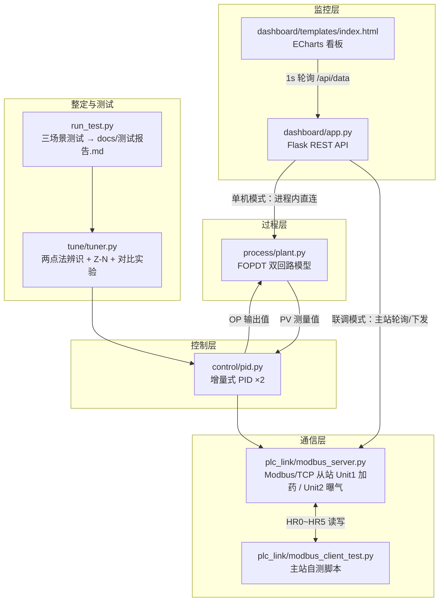

# 水处理加药/曝气回路 PID 控制仿真

> 求职作品集项目 · Windows 10 + Python 3.12 · 仅用 numpy / flask / pymodbus + ECharts(CDN)
>
> ⚠️ **免责声明**：本项目所有受控过程为 FOPDT 数学模型仿真，所有模型参数为
> **典型经验值**，所有性能指标均为 **仿真验证值**，不代表任何真实水厂的
> 实际工况、性能或安全水平。不可用于真实工程决策。

---

## 1. 项目简介

在没有真实仪表和 PLC 的条件下，完整实现一条工业控制闭环：

- **过程层**：加药回路（变频泵开度% → 出水余氯 mg/L）与曝气回路
  （风机频率 Hz → 溶解氧 mg/L）两个独立 FOPDT（一阶惯性+纯滞后）模型，
  dt=1s，含高斯测量噪声与进水负荷扰动注入；
- **控制层**：增量式 PID——输出限幅、反算法抗积分饱和、测量死区、
  手/自动无扰切换、微分先行 + 不完全微分 + 微分限幅、参数在线修改；
- **整定**：两点法响应曲线辨识（K/T/τ）→ Z-N 公式 → 工程修正，
  保守参数与整定参数同场景对比；
- **联调层**：pymodbus Modbus/TCP 从站（双 Unit，HR0~HR5 寄存器映射，
  心跳 + 报警位），附主站自测脚本；
- **监控层**：Flask + ECharts 看板——双回路实时趋势（最近 500 点回看）、
  SP 下发、手/自动切换、软手操、PID 在线整定、报警列表；
  支持单机模式与 Modbus 主站联调模式。

## 2. 系统架构



## 3. 快速开始

### 3.1 环境要求

- Windows 10 / 11，Python 3.12（3.10+ 理论可用，未验证）
- 依赖：`numpy`、`flask`、`pymodbus==3.6.9`（本机验证版本组合）
- 看板页面经 CDN 加载 ECharts，浏览器需联网

### 3.2 安装

```powershell
cd Water-Treatment-PID-Control-Simulation
pip install -r requirements.txt
# 或：pip install numpy flask pymodbus==3.6.9
```

### 3.3 启动顺序

| 步骤 | 命令 | 说明 |
|---|---|---|
| ①（可选）整定实验 | `python -m tune.tuner` | 生成 `docs/整定对比报告.md` + 曲线页 |
| ②（可选）Modbus 从站 | `python -m plc_link.modbus_server --port 5020` | 双 Unit 从站，Ctrl+C 退出 |
| ③（可选）从站自测 | `python -m plc_link.modbus_client_test --port 5020` | 17 项通信测试，退出码 0=全通过 |
| ④ Web 看板（单机） | `python -m dashboard.app` | 浏览器打开 http://127.0.0.1:5000 |
| ④' Web 看板（联调） | `python -m dashboard.app --modbus 127.0.0.1:5020 --port 5001` | 需先执行②，看板经 Modbus 读写从站 |
| ⑤ 场景测试（核心产出） | `python run_test.py` | 生成 `docs/测试报告.md` + `docs/测试曲线.html` |

> 最小体验路径：只执行 ④，即可在单机模式体验全部看板功能。

### 3.4 看板操作要点

1. **SP 下发**：输入新设定值 → 点"SP下发"；
2. **手/自动**：切手动时弹窗输入初始手操值（默认当前输出，保证无扰）；
   手动状态下"手操下发"可用；
3. **在线整定**：修改 Kp/Ti/Td → 点"应用参数"，立即生效无需重启
   （联调模式下该功能被禁用并给出提示——标准寄存器表无参数区）；
4. **历史回看**：趋势图下方缩放条可在最近 500 点内自由回看；
5. **报警**：连续 5 个周期越限确认后出现在报警列表（激活/恢复均有记录）。

## 4. 目录结构

```text
Water-Treatment-PID-Control-Simulation/
├── README.md                    本文件
├── requirements.txt             依赖清单
├── run_test.py                  三大场景测试 → 自动生成测试报告（核心产出）
├── process/
│   ├── __init__.py
│   └── plant.py                 FOPDT 双回路过程模型（含扰动注入/噪声）
├── control/
│   ├── __init__.py
│   └── pid.py                   增量式 PID（限幅/抗饱和/死区/无扰切换）
├── tune/
│   ├── __init__.py
│   └── tuner.py                 两点法辨识 + Z-N 整定 + 参数对比实验
├── plc_link/
│   ├── __init__.py
│   ├── modbus_server.py         Modbus/TCP 从站（模拟 PLC，双 Unit，只读写保护）
│   ├── common.py                寄存器映射/报警逻辑单一事实来源
│   └── modbus_client_test.py    Modbus 主站自测脚本（17 项检查）
├── dashboard/
│   ├── __init__.py
│   ├── app.py                   Flask 后端（单机/Modbus 联调双模式）
│   └── templates/index.html     ECharts 看板单页
├── docs/
│   ├── 系统设计说明书.md         建模依据/抗饱和原理/整定计算过程
│   ├── 组态点表.md               AI/AO/DI/DO 点表 + Modbus 映射
│   ├── 测试报告.md               run_test.py 自动生成（仿真验证值）
│   ├── 测试曲线.html             场景对比曲线（ECharts）
│   ├── 整定对比报告.md           tuner.py 自动生成（仿真验证值）
│   ├── 整定对比曲线.html         保守 vs Z-N vs 工程修正曲线
│   ├── 验收清单.md               逐项验收结果（实测证据）
│   └── 面试问答.md               10 个深挖问题及回答要点
└── resume/
    ├── 项目总结.md               第一人称项目复盘（600 字）
    └── 简历项目描述.md           简历用 150 字量化描述
```

## 5. 性能指标（全部为仿真验证值）

### 5.1 过程辨识（两点法，40% 量程阶跃）

| 回路 | K 真值→辨识 | T(s) 真值→辨识 | τ(s) 真值→辨识 |
|---|---|---|---|
| 加药 | 0.080 → 0.0800 | 120 → 119.9 | 30 → 29.0 |
| 曝气 | 0.120 → 0.1200 | 90 → 89.9 | 15 → 14.0 |

### 5.2 场景测试（保守参数 vs Z-N 工程修正参数）

| 场景 | 回路 | 关键指标（保守 → 整定） |
|---|---|---|
| ① SP 阶跃 +10% | 加药 | IAE 27.42 → **25.06**；超调 4.5% → 17.4% |
| ① SP 阶跃 +10% | 曝气 | 调节时间 29 s → **19 s**；超调 2.2% → 22.4% |
| ② 负荷阶跃 +30% | 加药 | 最大偏差 1.28 → **0.63 %FS**；恢复 319 s → **173 s** |
| ② 负荷阶跃 +30% | 曝气 | 最大偏差 0.82 → **0.16 %FS**（未越出 0.5%FS 恢复带） |
| ③ 噪声干扰 ×5 | 双回路 | 整定组 OP 动作强度约为保守组 2 倍——强整定的噪声代价，须配合不完全微分+限幅 |

> 完整指标表、口径定义与结论：`docs/测试报告.md`；
> Z-N 原始值 vs 工程修正值的对照：`docs/整定对比报告.md`。

### 5.3 通信与看板（仿真验证值）

| 项目 | 结果 |
|---|---|
| Modbus 主站自测 | 17/17 项 PASS（含 SP 下发回读、手自动切换、闭环响应、心跳、只读写保护） |
| 寄存器地址一致性 | HR0↔地址0 回读写入实测一致（pymodbus 3.6.9 zero_mode） |
| 看板轮询 | 1 Hz，与控制周期同步；最近 500 点历史回看 |

## 6. REST API 一览

| 方法 | 路径 | 说明 |
|---|---|---|
| GET | `/api/data` | 全量快照（当前值 + 500 点历史 + 报警流水） |
| GET | `/api/state` | 轻量状态（不含历史数组） |
| GET | `/api/history?points=500` | 历史数据（上限 500 点） |
| POST | `/api/sp` | `{"loop":"dosing","value":1.1}` SP 下发 |
| POST | `/api/mode` | `{"loop":"aeration","auto":false,"manual_op":20}` 手自动切换 |
| POST | `/api/manual` | `{"loop":"dosing","value":35}` 软手操（仅手动） |
| POST | `/api/tuning` | `{"loop":"dosing","kp":31,"ti":87,"td":14.5}` 在线整定 |

`loop` 取值：`dosing`（加药）/ `aeration`（曝气）。校验失败返回 400 + JSON。

## 7. 各模块自检命令

```powershell
python -m process.plant        # FOPDT 开环阶跃自检（稳态 vs 解析值）
python -m control.pid          # PID 闭环/抗饱和/无扰切换自检
python -m tune.tuner           # 辨识 + Z-N + 三组参数对比 + 报告生成
python -m plc_link.modbus_server --port 5020    # 从站
python -m plc_link.modbus_client_test --port 5020  # 主站自测（另开终端）
python run_test.py             # 三场景测试 + 报告
```

## 8. 技术要点（详见 docs/系统设计说明书.md）

- 增量式 PID 的微分增量必须是**相邻两拍微分位置值之差**——直接累加微分
  位置值等效于多串一个积分器，本项目实测会导致闭环发散振荡；
- 反算法抗积分饱和：限幅截断差按 1/Tt 回灌积分累计，退出饱和无拖尾；
- 微分先行（避免 SP 阶跃微分冲击）+ 不完全微分（Tdf=Td/N，本项目对照
  实验证明噪声大的回路 N=2 优于 N=5）+ 微分限幅（±10% 量程/拍）；
- Z-N 建议值必须工程修正：原始值在本项目曝气回路实测为临界稳定
  （超调 121.8%、调节时间 1095 s）；
- Modbus 主站多线程共享连接必须加锁，否则事务 ID 错乱（实测踩坑）。

## 9. License / 用途声明

仅用于学习与求职作品集展示。转载或二次使用请保留本声明。
**所有数据均为仿真验证值，与任何真实水厂无关。**
