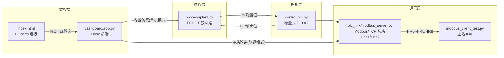

# 系统设计说明书

> 项目：水处理加药/曝气回路 PID 控制仿真
> 性质说明：本文所有模型参数为**典型经验值**，所有性能数据为**仿真验证值**，
> 不代表任何真实水厂的实际工况与性能。

---

## 1. 设计目标与边界

| 项目 | 说明 |
|---|---|
| 目标 | 在无真实仪表、无真实 PLC 条件下，完整实现「过程模型 → PID 控制 → Modbus/TCP 联调 → Web 看板」工业控制闭环 |
| 受控过程 | FOPDT（一阶惯性 + 纯滞后）数学模型，双回路独立 |
| 控制算法 | 增量式 PID（限幅 / 抗积分饱和 / 死区 / 无扰切换 / 不完全微分） |
| 通信 | pymodbus 实现 Modbus/TCP 从站（模拟 PLC），主站自测脚本验证 |
| 上位监控 | Flask + ECharts 单页看板，支持单机模式与 Modbus 联调模式 |

---

## 2. 总体架构与数据流



两种部署形态：

1. **单机模式**：`dashboard/app.py` 进程内直接跑过程模型 + PID；
2. **联调模式**：`--modbus host:port` 参数使看板成为 Modbus/TCP **主站**，
   与 `modbus_server.py` 从站构成真实的上位机 ↔ PLC 通信链路。

---

## 3. FOPDT 过程建模

### 3.1 机理依据

水处理的加药与曝气回路具有共同特征：

- 容积池体（接触池/曝气池）起**混合缓冲**作用 → 浓度响应呈一阶惯性；
- 药剂管路输送、取样管路延迟、风机-液相氧传递 → 存在**纯滞后**；
- 工作点附近增益近似线性 → 可用常数 K 描述。

因此工作点附近用 FOPDT 线性化模型是行业通行做法：

```
T · dPV(t)/dt + PV(t) = K · OP(t − τ) + D(t)
```

### 3.2 离散化实现（dt = 1 s）

采用指数保持离散（比前向欧拉更稳定，大步长下不引入虚假振荡）：

```
a = exp(−dt/T)
PV[k+1] = a·PV[k] + (1−a)·( K·OP[k−round(τ/dt)] + D[k] )
```

纯滞后用 OP 历史队列（`collections.deque`，长度 = τ/dt + 1）实现。

负荷扰动通道（进水流量变化）经一阶滤波叠加在稳态值上：

```
D_target = k_load · (L − 100%)      L 为进水负荷百分比
D[k+1] = exp(−dt/T_D)·D[k] + (1−exp(−dt/T_D))·D_target
```

进水量增大对两回路均为不利方向（稀释余氯 / 提高耗氧），故 `k_load < 0`。

测量环节叠加高斯白噪声 `N(0, σ)`，并提供 `set_noise_scale()` 倍乘接口供
噪声鲁棒性场景使用。

### 3.3 模型参数（典型经验值）

| 回路 | 操作量→被控量 | K | T(s) | τ(s) | σ | k_load |
|---|---|---|---|---|---|---|
| 加药 | 泵开度%(→余氯 mg/L) | 0.08 | 120 | 30 | 0.02 | −0.006 |
| 曝气 | 风机 Hz(→DO mg/L) | 0.12 | 90 | 15 | 0.03 | −0.008 |

**验证**：开环施加 30% 泵开度阶跃，仿真稳态 2.40 mg/L 与解析值 `K·ΔOP = 0.08×30 = 2.40 mg/L`
一致（见 `python -m process.plant` 自检输出）。

---

## 4. 增量式 PID 控制器设计

### 4.1 为什么选增量式（Δu 算法）

| 维度 | 增量式 | 位置式 |
|---|---|---|
| 积分饱和 | 天然较轻（增量基于被限幅后的实际输出累加） | 需额外抗饱和 |
| 手/自动切换 | 切换点即当前实际输出，易实现无扰 | 需重置积分初值 |
| 输出突变 | 单拍只走一个增量，天然限速 | 可能一步跳变 |
| 计算量 | 只需最近三个误差样本 | 需误差累加和 |

### 4.2 增量式公式

由位置式 `u = Kp(e + (1/Ti)∫e dt + Td de/dt)` 相邻两拍相减得到：

```
Δu[k] = Kp·[(e[k] − e[k−1]) + (dt/Ti)·e[k]] + (Ud[k] − Ud[k−1])
u[k]  = clamp( u[k−1] + Δu[k], out_min, out_max )
```

其中微分项以「位置值之差」参与增量：`Ud[k] = Kp·Td·(滤波后 PV 变化率取负)`。

> ⚠️ 实现教训（本项目开发中实测踩坑）：若把 `Kp·Td·dPV/dt` 这个**位置值**
> 直接当增量每拍累加进输出，等效于给回路多串了一个微分积分器，
> 闭环会发散成等幅振荡（实测 OP 在 13%↔78% 间振荡发散）。微分增量的
> 正确形态是二阶差分或相邻两拍位置值之差。

### 4.3 抗积分饱和——增量式固有钳位（clamping）+ 退饱和诊断量

**不加抗饱和的后果**：输出长时间顶在上限时，积分仍在负误差方向持续累积
（或反之），待 PV 回升需要降输出时，必须先“消化”掉深饱和的积分累计，
造成大幅超调与长时间振荡，严重时引发工艺事故（如余氯超标）。

**本控制器的抗饱和机理（如实表述）**：增量式算法的输出由增量直接累加在
「上拍已限幅输出」上：

```
u[k] = clamp( u[k−1] + Δu[k], out_min, out_max )
```

累加基点永远是被限幅后的实际输出，输出不可能越限堆积——增量式 + 限幅
天然不会积分饱和（工业上称 clamping/遇限停积的连续化形式），退出饱和
无拖尾。控制器另维护一个**积分诊断量** `_i_sat_diag`：把限幅截断差

```
back = clamp(op_unsat) − op_unsat        # ≠0 表示限幅生效（>0 撞下限、<0 撞上限）
_i_sat_diag += ΔI + back·(dt/Tt)         # Tt = max(Td, 10·dt)
```

按 1/Tt 的速率回灌给它，使其在饱和期间呈退饱和趋势（增速低于名义积分
增速）。注意两点：① 该诊断量**只用于显示与调试，不参与控制律**，真正
防止积分饱和的是上述固有钳位；② 持续饱和下它仍会缓慢增长（每拍净增约
`ΔI·(1−dt/Tt)`），属诊断量固有局限。

**自检证据（真实触发饱和）**：`python -m control.pid` 的"强制饱和自检"
段用小量程 out_max=20% + 不可达 SP=2.0 mg/L 让输出必然撞限——饱和段
OP 顶在 20%、饱和修正列为非零负值，t=400s 放宽 SP 后 OP 一拍内离开
20%（20%→约 5%），无积分拖尾。

> 表述更正说明（代码评审修复项）：早期文档把上述诊断量回灌称为
> "反算法（back-calculation）抗饱和"，实际 back 项不影响控制律；增量式
> 方案下无需再引入位置式积分状态。若采用位置式控制器，反算法
> `I += dt/Ti·e + dt/Tt·(u_sat − u_unsat)` 才真正参与控制律。

### 4.4 测量死区

`|SP − PV| ≤ deadband` 时比例/积分增量置零（加药 0.005 mg/L、曝气 0.01 mg/L），
抑制小幅度噪声引起的执行器频繁微动；死区内微分仍正常作用。

### 4.5 微分先行 + 不完全微分 + 微分限幅

三个递进的工程问题与对策：

| 问题 | 现象（本项目实测） | 对策 |
|---|---|---|
| 对偏差 e 微分 | SP 阶跃瞬间 OP 直接打到 100%（微分冲击） | 微分先行：只对 PV 微分 |
| 对带噪 PV 直接二阶差分 | OP 抖动 ±2~3%，切手动后无法平稳跟踪 | 一阶低通后再微分（不完全微分） |
| 强整定 + 强噪声 | OP 波动 σ 达量程 9.6%，激励真实工艺波动 | 微分增量逐拍限幅 ±10% 量程 |

不完全微分等效传递函数：`Kp·Td·s / (1 + Tdf·s)`，`Tdf = Td/N`。
N 的取值做了对照实验（Z-N 工程修正参数，数据见 `docs/整定对比报告.md`
附录，由 `python -m tune.tuner` 自动生成；N 现可经
`PIDController(deriv_filt_n=...)` 按实例配置）：

- 曝气回路伺服场景：N=5 超调 127.0%、调节时间覆盖整个观察窗（1200s，
  慢频振荡）；N=2 同参数超调 22.4%、调节时间 19s；
- 噪声×5 场景：N=2 相比 N=5 的 OP 动作强度降约 7%~35%、
  IAE(真值) 降约 32%~64%。

故默认 N=2（工程上按噪声水平取 2~5）。

### 4.6 手动/自动无扰切换

- **自动→手动**：手动给定初值缺省取当前输出，输出连续；
- **手动→自动**：无扰的本质是输出状态 `_op` 直接承接手操值——切回自动
  瞬间增量从手操值继续累加，不产生跳变（bumpless transfer）；手动期间
  积分【诊断量】按 `I = u_manual − Kp·e[k−1]` 刷新，仅供显示核对，
  不参与控制。实测 t=600 s 切换时输出 20% → 18.4%，无跳变
  （自检脚本可见）。
- P/I/D 参数在线修改同样无扰：增量只作用在「上拍已限幅输出」上，
  改参数只影响后续增量。

---

## 5. 参数整定：两点法辨识 + Z-N + 工程修正

### 5.1 响应曲线法辨识（两点法）

开环施加 40% 量程的 OP 阶跃，记录无噪 PV 响应，利用 FOPDT 归一化响应
`y/y∞ = 1 − exp(−(t−τ)/T)` 的两个特征点：

```
y/y∞ = 28.3% → t28 = τ + 0.3327·T
y/y∞ = 63.2% → t63 = τ + 1.0000·T
⇒ T = (t63 − t28)/0.6673 ，  τ = t63 − T ，  K = y∞/ΔOP
```

选 28.3%/63.2% 是因为其时间常数间隔最大（0.667T），对插值误差最不敏感；
相比切线法（需找拐点作切线），两点法只需两个采样时刻，抗噪能力强得多。

**本项目辨识结果（仿真验证值）**：

| 回路 | K（真值→辨识） | T(s) | τ(s) |
|---|---|---|---|
| 加药 | 0.080 → 0.0800（误差 0%） | 120 → 119.9 | 30 → 29.0 |
| 曝气 | 0.120 → 0.1200（误差 0%） | 90 → 89.9 | 15 → 14.0 |

### 5.2 Z-N 响应曲线法计算过程（代入实测数字）

公式：`Kp = 1.2·T/(K·τ)`，`Ti = 2τ`，`Td = 0.5τ`

**加药回路**：
```
Kp = 1.2 × 119.9 / (0.0800 × 29.0) = 62.00
Ti = 2 × 29.0 = 58.0 s
Td = 0.5 × 29.0 = 14.51 s
```

**曝气回路**：
```
Kp = 1.2 × 89.9 / (0.1200 × 14.0) = 64.19
Ti = 2 × 14.0 = 28.0 s
Td = 0.5 × 14.0 = 7.01 s
```

### 5.3 为什么做工程修正（Kp×0.5、Ti×1.5）

Z-N 以 4:1 衰减为目标，稳定裕度极小。本项目闭环验证（仿真验证值）：

- 加药回路原始 Z-N：超调 89.1%、IAE 34.34 ——可用但剧烈；
- 曝气回路原始 Z-N：**临界稳定**，超调 121.8%、调节时间 1095 s、
  出现持续等幅振荡（相位裕度估算≈0°，叠加噪声激励）；
- 工程修正值（Kp×0.5、Ti×1.5）：加药超调降至 17.4%、IAE 最优 25.06；
  曝气调节时间缩至 19 s。

结论：**Z-N 结果只能当起点，必须结合回路特性修正并用闭环试验确认**。
详见 `docs/整定对比报告.md`。

---

## 6. Modbus/TCP 联调设计

### 6.1 寄存器映射（0.01 工程单位定标）

| 寄存器 | 内容 | 方向 | 定标 |
|---|---|---|---|
| HR0 | SP 设定值 | 主站写 | ×100 |
| HR1 | PV 测量值 | 从站写 | ×100 |
| HR2 | OP 输出值 | 从站写 | ×100 |
| HR3 | 1=自动 0=手动 | 主站写 | — |
| HR4 | 报警码 bit0高限/bit1低限/bit2偏差 | 从站写 | 位域 |
| HR5 | 心跳计数 | 从站写 | mod 65536 |
| HR8 | 手操值（手动模式生效） | 主站写 | ×100 |

Unit 1 = 加药回路，Unit 2 = 曝气回路（同构布局）。

设计要点：

- **定标 ×100**：Modbus 寄存器是 16 位整型，无原生浮点。0.01 分辨率
  对 mg/L 级工艺足够（量程 5/10 mg/L → 最大 500/1000，远小于 65535）；
  若需更高分辨率可用两个寄存器拼 32 位定点或 IEEE754。
- **心跳**：上位机据此判断从站程序存活（通信正常但程序死锁的典型检测手段）。
- **报警消抖**：连续 5 个周期越限才置位，防瞬间越限误报；判断用真值而非
  带噪测量值。
- **手操值 HR8**：主站为唯一写方（从站只读不写，无写冲突）；从站边沿
  检测——手动模式下寄存器值相对上拍变化才应用，切手动未写值则输出
  保持切换瞬间值（无扰缺省），自动模式下写入仅更新基准、不影响输出。
- **遥测定标钳位**：×100 定标结果钳位到 [0, 65535]，从站内部遥测通道
  钳位而非 %65536 回绕——异常值饱和显示，不会回绕成假读数。
- **地址约定**：pymodbus 3.6.x 下 `ModbusSlaveContext(zero_mode=True)`
  保证 HR0 与客户端地址 0 对应（已用主站读写回环实测验证）。

### 6.2 线程与并发

从站：主线程跑 pymodbus 服务，后台 daemon 线程按 1 s 节拍
「读给定→PID 运算→写回数据」；数据区并发访问依赖 CPython GIL
（单写多读场景够用，真实工程应加锁的数据块）。

主站侧（看板联调模式）：Flask 请求线程与轮询线程**共用一条 TCP 连接**，
必须加锁串行化——本项目实测发现并发读写会导致事务 ID 错乱、请求互相干扰，
这是主站程序开发的经典陷阱（已修复并写入验收清单）。

---

## 7. Web 看板设计

- 后端每秒推进一次仿真并维护各回路最近 500 点环形缓冲；
- 前端 `fetch` 每秒轮询 `/api/data` 全量快照，ECharts 双图表渲染
  SP/PV（左轴）与 OP（右轴），`dataZoom` 支持最近 500 点自由回看；
- 操作接口：`POST /api/sp`（SP 下发）、`/api/mode`（手自动）、
  `/api/manual`（软手操）、`/api/tuning`（在线整定），
  参数校验失败返回 HTTP 400 + JSON 错误信息；
- 报警流水（激活/恢复边沿记录）在看板表格展示；
- 选型说明：1 s 级刷新用轮询已足够且实现简单；若需秒级以内或多客户端
  广播，应升级 WebSocket/SSE。

---

## 8. 测试指标定义（测试报告口径）

| 指标 | 定义 |
|---|---|
| 超调量 % | （峰值PV − 终态平均PV）/ 设定值阶跃幅值 ×100（伺服场景） |
| 最大偏差 %FS | 事件后最大偏差绝对值 / 面板量程 ×100（扰动场景） |
| 调节时间 s | 误差最后一次越出 ±2%FS 的时刻（相对事件发生时刻） |
| 恢复时间 s | 偏差回落到 ±0.5%FS 并保持的时刻（扰动场景专用） |
| 稳态误差 %FS | 事件后末段 90 s 平均误差 / 量程 ×100 |
| IAE | Σ\|SP−PV测量\|·dt；噪声场景另列 IAE(真值) |
| OP 动作强度 | 输出标准差，表征执行器磨损风险 |

---

## 9. 已知局限与改进方向

1. 模型为工作点附近线性化，未涵盖药剂耗竭、曝气头结垢等慢时变效应
   （改进：增益调度 / 自适应整定）;
2. 双回路独立建模，未模拟加氯与氨氮消耗的耦合（改进：多变量模型）；
3. Modbus 未实现 TLS/用户鉴权（真实工程应置于工控隔离网闸之后）；
4. 看板轮询为单机演示级，多客户端应改 WebSocket 广播 + 消息队列；
5. DI/DO 点位已在组态点表中规划，本版本仿真未启用（见组态点表说明）。
